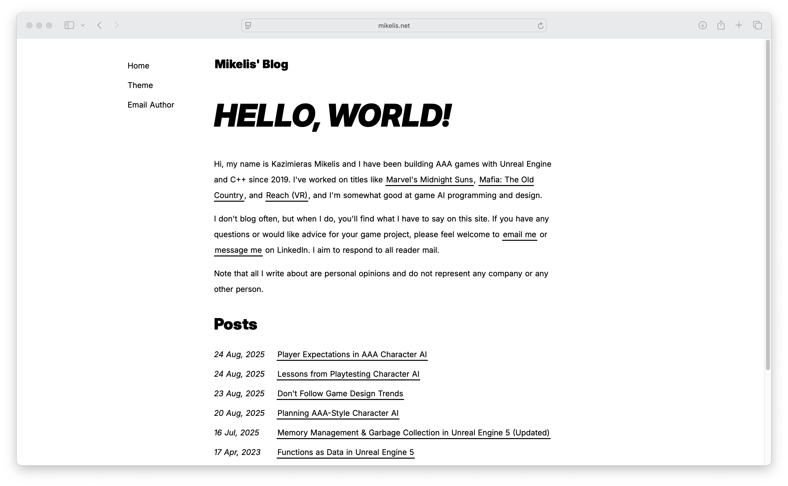
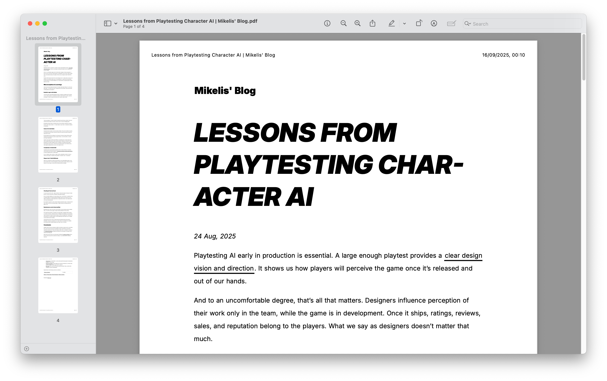

# Bearblog Claritas Theme
A minimalistic and accessible theme for [Bearblog](https://bearblog.dev/).

## Features
- Strict, geometric proportions
- Pretty good accessibility
- Responsive design
- Alternating row colors for tables
- Media targets:
    - Light/dark modes
    - Small/large screens
    - Printing

## Screenshots





|  |  |  |
|-------------------------------------|-------------------------------------|-------------------------------------|


## Installation
Open [style.css](https://raw.githubusercontent.com/kazimieras-mi/bearblog-claritas-theme/refs/heads/main/style.css) and copy the contents into the "Edit theme CSS" box in Bearblog themes page.

Remember to back up your existing theme.

## Image Hacks
Bearblog supports `` tags for image embedding. You can use the following image classes with this theme:
- `small-image`: makes the image small
- `tiny-image`: makes the image tiny
- `inverting`: inverts the image colors in dark mode

## Headless Table Hack
Add a headless table with the following Markdown code, and the header row won't display empty – it will not display at all:
```
||||
|------|------|------|
|Cell A|Cell B|Cell C|
```

Enjoy!