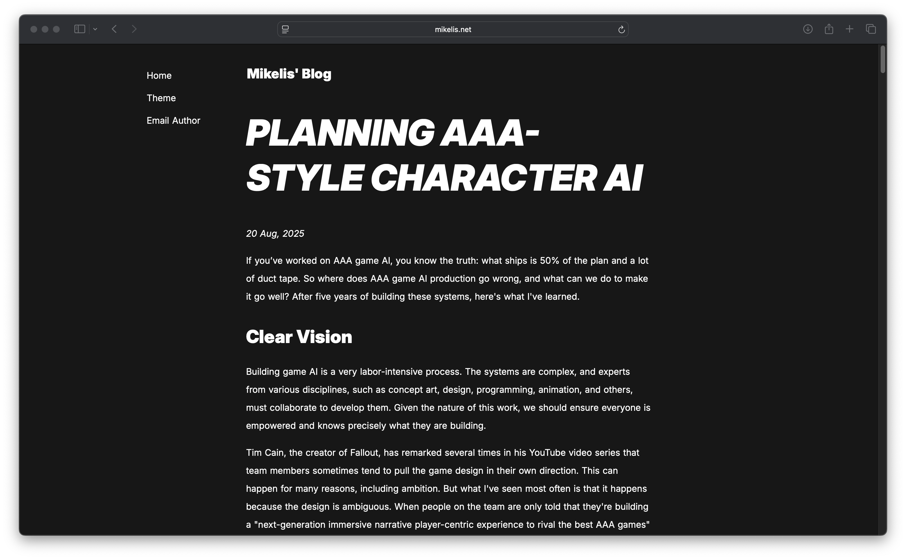
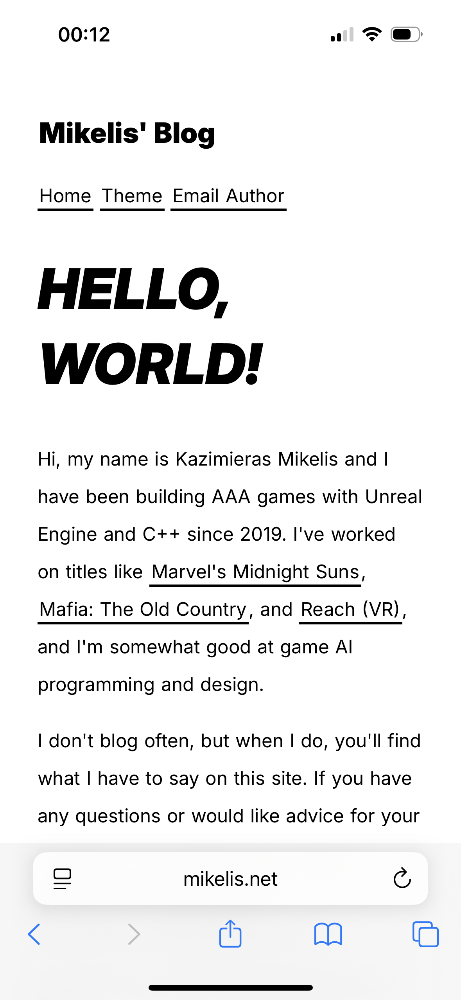

# Bearblog Claritas Theme
A minimalistic and accessible theme for [Bearblog](https://bearblog.dev/).

## Features
- Strict, geometric proportions
- Pretty good accessibility
- Responsive design
- Alternating row colors for tables
- Media targets:
    - Light/dark modes
    - Small/large screens
    - Printing
- Hacks

## Screenshots

## Installation
Open [style.css](https://raw.githubusercontent.com/kazimieras-mi/bearblog-claritas-theme/refs/heads/main/style.css) and copy the contents into the "Edit theme CSS" box in Bearblog themes page.

Remember to back up your existing theme.

## Hacks
### Image Sizes
Embed images with `` or `` to get smaller image sizes that still follow geometric rules of the theme.

### Image Dark Mode
If the image is embedded with a class `inverting`, its colors will be inverted in dark mode. This is useful for schematics.

### Utility Classes
Class `center` centers the element. `block` makes it a block element (text will appear above and below it). `inline` does the opposite. `invisible` hides the element, `invisible-on-print` hides an element in print only.

### Infobox
Info boxes can be created with highlights: `==Info Box Text==`.

